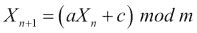

# 第 7 章加密与编码

在本章中，我们将介绍以下主题：

*   生成 MD5 哈希
*   生成 SHA 1/128/256 哈希
*   同时实现 SHA 和 MD5 哈希
*   在真实场景中实现 SHA
*   生成 Bcrypt 散列
*   破解 MD5 哈希
*   使用 Base64 编码
*   用 ROT13 编码
*   破解替换密码
*   破解 Atbash 密码
*   攻击一次性 pad 重用
*   线性同余发生器的预测
*   识别散列

# 导言

在本章中，我们将介绍 Python 世界中的加密和编码。加密和编码是 web 应用程序的两个非常重要的方面，因此使用 Python 来实现它们！

我们将深入了解 MD5 和 SHA 哈希的世界，敲开 Base64 和 ROT13 的大门，并了解一些最流行的哈希和密码。我们还将回顾过去，并研究一些非常古老的方法和方法来制造和打破它们。

# 生成 MD5 哈希

MD5 散列是 web 应用程序中最常用的散列之一，因为它易于使用，并且散列速度快。MD5 散列是 1991 年发明的，用来取代以前的版本 MD4，至今仍在使用。

## 准备好了吗

对于这个脚本，我们只需要`hashlib`模块。

## 怎么做…

由于我们可以导入的模块的性质，在 Python 中生成 MD5 哈希非常简单。我们需要定义要导入的模块，然后决定要散列哪个字符串。我们应该将其硬编码到脚本中，但这意味着每次对新字符串进行哈希运算时都必须修改脚本。

相反，我们使用 Python 中的`raw_input`功能向用户请求字符串：

```py
import hashlib
message = raw_input("Enter the string you would like to hash: ")
md5 = hashlib.md5(message.encode())
print (md5.hexdigest())
```

## 它是如何工作的…

`hashlib`模块在幕后为我们完成了大部分工作。Hashlib 是一个巨大的库，它使用户能够非常快速、轻松地对 MD5、SHA1、SHA256 和 SHA512 等进行哈希运算。这就是使用本模块的理由。

我们首先使用标准方法导入模块：

```py
import hashlib
```

然后我们需要我们希望 MD5 编码的字符串。如前所述，这可以硬编码到脚本中，但并不十分实用。解决方法是使用`raw_input`功能向用户请求输入。这可以通过以下方式实现：

```py
message = raw_input("Enter what you wish to ask the user here: ")
```

一旦有了输入，我们就可以继续使用 hashlib 的内置函数对字符串进行编码。为此，在定义要使用的字符串后，我们只需调用`.encode()`函数：

```py
md5 = hashlib.md5(message.encode())
```

最后，我们可以打印使用`.hexdigest()`函数的字符串的输出。如果我们不使用`hexdigest`，将打印每个字节的十六进制表示。

下面是一个例子的脚本正在全面展开：

```py
Enter the string you would like to hash: pythonrules
048c0fc556088fabc53b76519bfb636e

```

# 生成 SHA 1/128/256 哈希

SHA 哈希也非常常用，与 MD5 哈希一起使用。SHA 哈希的早期实现始于 SHA1，由于哈希的弱点，现在很少使用 SHA1。SHA1 之后是 SHA128，然后被 SHA256 取代。

## 准备好了吗

同样，对于这些脚本，我们只需要`hashlib`模块。

## 怎么做…

通过使用导入的模块，在 Python 中生成 SHA 哈希也非常简单。通过简单的调整，我们可以更改是生成 SHA1、SHA128 还是 SHA256 哈希。

以下是三个不同的脚本，允许我们生成不同的 SHA 哈希：

以下是 SHA1 的脚本：

```py
import hashlib
message = raw_input("Enter the string you would like to hash: ")
sha = hashlib.sha1(message)
sha1 = sha.hexdigest()
print sha1
```

以下是 SHA128 的脚本：

```py
import hashlib
message = raw_input("Enter the string you would like to hash: ")
sha = hashlib.sha128(message)
sha128 = sha.hexdigest()
print sha128
```

以下是 SHA256 的脚本：

```py
import hashlib
message = raw_input("Enter the string you would like to hash: ")
sha = hashlib.sha256(message)
sha256 = sha.hexdigest()
print sha256
```

## 它是如何工作的…

`hashlib`模块再次为我们完成了大部分工作。我们可以利用模块内的功能。

我们首先使用以下方法导入模块：

```py
import hashlib
```

然后我们需要提示使用 SHA 对字符串进行编码。我们要求用户输入，而不是使用硬编码，这样脚本就可以反复使用。这可以通过以下方式实现：

```py
message = raw_input("Enter the string you would like to hash: )
```

一旦我们有了字符串，我们就可以开始编码过程了。下一部分取决于您要使用的 SHA 编码：

```py
sha = hashlib.sha*(message)
```

我们需要将`*`替换为`1`、`128`或`256`。一旦我们对消息进行了 SHA 编码，我们需要再次使用`hexdigest()`函数，以便输出变得可读。

我们通过以下方式做到这一点：

```py
sha*=sha.hexdigest()
```

一旦输出变得可读，我们只需打印哈希输出：

```py
print sha*
```

# 同时实现 SHA 和 MD5 哈希

在本节中，我们将了解 SHA 和 MD5 散列如何协同工作。

## 准备好了吗

对于下面的脚本，我们只需要`hashlib`模块。

## 怎么做…

我们将把之前所做的一切结合在一起，形成一个大剧本。这将输出三个版本的 SHA 哈希和一个 MD5 哈希，因此用户可以选择使用哪一个：

```py
import hashlib

message = raw_input("Enter the string you would like to hash: ")

md5 = hashlib.md5(message)
md5 = md5.hexdigest()

sha1 = hashlib.sha1(message)
sha1 = sha1.hexdigest()

sha256 = hashlib.sha256(message)
sha256 = sha256.hexdigest()

sha512 = hashlib.sha512(message)
sha512 = sha512.hexdigest()

print "MD5 Hash =", md5
print "SHA1 Hash =", sha1
print "SHA256 Hash =", sha256
print "SHA512 Hash =", sha512
print "End of list."
```

## 它是如何工作的…

再次，在将正确的模块导入此脚本后，我们需要接收用户输入，我们希望将其转换为编码字符串：

```py
import hashlib
message = raw_input('Please enter the string you would like to hash: ')
```

从这里开始，我们可以通过所有不同的编码方法发送字符串，并确保它们通过`hexdigest()`传递，以便输出变得可读：

```py
md5 = hashlib.md5(message)
md5 = md5.hexdigest()

sha1 = hashlib.sha1(message)
sha1 = sha1.hexdigest()

sha256 = hashlib.sha256(message)
sha256 = sha256.hexdigest()

sha512 = hashlib.sha512(message)
sha512 = sha512.hexdigest()
```

一旦我们创建了所有编码字符串，只需将其中的每一个打印给用户即可：

```py
print "MD5 Hash =", md5
print "SHA1 Hash =", sha1
print "SHA256 Hash =", sha256
print "SHA512 Hash =", sha512
print "End of list."
```

下面是一个正在运行的脚本的示例：

```py
Enter the string you would like to hash: test
MD5 Hash = 098f6bcd4621d373cade4e832627b4f6
SHA1 Hash= a94a8fe5ccb19ba61c4c0873d391e987982fbbd3
SHA256 Hash= 9f86d081884c7d659a2feaa0c55ad015a3bf4f1b2b0b822cd15d6c15b0f00a08
SHA512 Hash= ee26b0dd4af7e749aa1a8ee3c10ae9923f618980772e473f8819a5d4940e0 db27ac185f8a0e1d5f84f88bc887fd67b143732c304cc5fa9ad8e6f57f50028a8ff
End of list.

```

# 在真实场景中实现 SHA

下面是一个实际 SHA 实现的示例。

## 准备好了吗

对于这个脚本，我们需要`hashlib`库和`uuid`库。

## 怎么做…

对于这个现实世界的示例，我们将实现一个 SHA256 编码方案，并生成一个 salt，通过击败预计算的哈希表使其更加安全。然后，我们将对其进行密码检查，以确保键入的密码正确：

```py
#!/usr/bin/python
import uuid
import hashlib

# Let's do the hashing. We create a salt and append it to the password once hashes.

def hash(password):
    salt = uuid.uuid4().hex
    return hashlib.sha512(salt.encode() + password.encode()).hexdigest() + ':' + salt

# Let's confirm that worked as intended.

def check(hashed, p2):
    password, salt = hashed.split(':')
    return password == hashlib.sha512(salt.encode() + p2.encode()).hexdigest()

password = raw_input('Please enter a password: ')
hashed = hash(password)
print('The string to store in the db is: ' + hashed)
re = raw_input('Please re-enter your password: ')

# Let's ensure the passwords matched

if check(hashed, re):
    print('Password Match')
else:
    print('Password Mismatch')
```

## 它是如何工作的…

要开始脚本，我们需要导入正确的库：

```py
import uuid
import hashlib
```

然后我们需要定义散列密码的函数。我们首先使用`uuid`库创建一个 salt。生成 salt 后，我们使用`hashlib.sha256`将 salt 编码和密码编码串在一起，并使用`hexdigest`使其可读，最后将 salt 附加到其末尾：

```py
def hash(password):
    salt = uuid.uuid4().hex
    return hashlib.sha512(salt.encode() + password.encode()).hexdigest() + ':' + salt
```

接下来，我们进入检查密码功能。这将确认我们的原始密码与第二个密码相同，以确保没有错误。这是通过使用与之前相同的方法完成的：

```py
def check(hashed, p2):
    password, salt = hashed.split(':')
    return password == hashlib.sha512(salt.encode() + p2.encode()).hexdigest()
```

一旦我们创建了所需的代码块，我们就可以开始向用户请求所需的输入。我们首先请求原始密码并使用`hash_password`函数创建散列。然后将其打印给用户。完成第一个密码后，我们会再次要求输入密码，以确保没有拼写错误。然后，`check_password`函数再次散列密码，并将原始密码与新密码进行比较。如果匹配，则通知用户密码正确；如果不匹配，则通知用户密码不匹配：

```py
password = raw_input('Please enter a password: ')
hashed = hash(password)
print('The string to store in the db is: ' + hashed)
re = raw_input('Please re-enter your password: ')
if check(hashed, re):
    print('Password Match')
else:
    print('Password Mismatch')
```

下面是正在使用的代码示例：

```py
Please enter a password: password
The string to store in the db is: a8be1e0e023e2c9c1e96187c4b966222ccf1b7d34718ad60f8f000094d39 d8dd3eeb837af135bfe50c7baea785ec735ed04f230ffdbe2ed3def1a240c 97ca127:d891b46fc8394eda85ccf85d67969e82
Please re-enter your password: password
Password Match

```

前面的结果是用户输入相同密码两次的示例。以下是用户未能输入相同密码的示例：

```py
Please enter a password: password1
The string to store in the db is: 418bba0beeaef52ce523dafa9b19baa449562cf034ebd1e4fea8c007dd49cb 1004e10b837f13d59b13236c54668e44c9d0d8dbd03e32cd8afad6eff04541 ed07:1d9cd2d9de5c46068b5c2d657ae45849
Please re-enter your password: password
Password Mismatch

```

# 生成 Bcrypt 哈希

一个不太常用但更安全的散列函数是**Bcrypt**。Bcrypt 哈希被设计为在加密和解密哈希时速度较慢。这种设计用于防止散列在散列泄露给公众（例如数据库泄露）时容易被破解。

## 准备好了吗

对于这个脚本，我们将在 Python 中使用`bcrypt`模块。这可以通过使用`pip`或`easy_install`进行安装，尽管您希望确保安装的是版本 0.4，而不是版本 1.1.1，因为版本 1.1.1 从`Bcrypt`模块中删除了一些功能。

## 怎么做…

在 Python 中生成 Bcrypt 哈希与生成其他哈希（如 SHA 和 MD5）类似，但也略有不同。与其他哈希一样，我们可以提示用户输入密码，也可以将密码硬编码到脚本中。由于使用随机生成的盐，Bcrypt 中的散列更为复杂，这些盐会附加到原始散列中。这增加了哈希函数的复杂性，因此提高了哈希函数中存储的密码的安全性。

这个脚本的末尾还有一个`checking`模块，它与一个真实的示例有关。它要求用户重新输入要散列的密码，并确保密码与原始输入匹配。密码确认在许多开发人员中是一种非常普遍的做法，在现代，几乎所有的注册表都使用这种方式：

```py
import bcrypt
# Let's first enter a password
new = raw_input('Please enter a password: ')
# We'll encrypt the password with bcrypt with the default salt value of 12
hashed = bcrypt.hashpw(new, bcrypt.gensalt())
# We'll print the hash we just generated
print('The string about to be stored is: ' + hashed)
# Confirm we entered the correct password
plaintext = raw_input('Please re-enter the password to check: ')
# Check if both passwords match
if bcrypt.hashpw(plaintext, hashed) == hashed:
    print 'It\'s a match!'
else:
    print 'Please try again.'
```

## 它是如何工作的…

我们通过导入所需的模块来启动脚本。在这种情况下，我们只需要`bcrypt`模块：

```py
import bcrypt
```

然后，我们可以使用标准的`raw_input`方法向用户请求输入：

```py
new = raw_input('Please enter a password: ')
```

在我们得到输入之后，我们就可以开始讨论基本的散列方法了。首先，我们使用`bcrypt.hashpw`函数对输入进行散列。然后我们给它输入密码的值，然后使用`bcrypt.gensalt()`随机生成一个 salt。这可以通过以下方式实现：

```py
hashed = bcrypt.hashpw(new, bcrypt.gensalt())
```

然后，我们将散列值打印给用户，以便用户可以看到已生成的散列：

```py
print ('The string about to be stored is: ' + hashed)
```

现在，我们开始密码确认。我们必须再次提示用户输入密码，以便确认他们输入的密码是否正确：

```py
plaintext = raw_input('Please re-enter the password to check: ')
```

获得密码后，我们使用 Python 中的`==`功能检查两个密码是否匹配：

```py
If bcrypt.hashpw(plaintext, hashed) == hashed:
  print "It\'s a match"
else:
  print "Please try again".
```

我们可以看到脚本正在运行，如下所示：

```py
Please enter a password: example
The string about to be stored is: $2a$12$Ie6u.GUpeO2WVjchYg7Pk.741gWjbCdsDlINovU5yubUeqLIS1k8e
Please re-enter the password to check: example
It's a match!

Please enter a password: example
The string about to be stored is: $2a$12$uDtDrVCv2vqBw6UjEAYE8uPbfuGsxdYghrJ/YfkZuA7vaMvGIlDGe
Please re-enter the password to check: incorrect
Please try again.

```

# 破解 MD5 哈希

由于 MD5 是一种加密方法，并且是公开可用的，因此可以使用破解哈希的常用方法创建哈希冲突。这反过来会“破解”散列，并在字符串经过 MD5 处理之前将其值返回给您。这通常是通过“字典”攻击实现的。这包括通过 MD5 编码过程运行单词列表，并检查其中是否有任何单词与您试图破解的 MD5 哈希匹配。这是因为如果对同一个单词进行哈希运算，MD5 哈希值总是相同的。

## 准备好了吗

对于这个脚本，我们只需要`hashlib`模块。

## 怎么做…

要开始破解 MD5 散列，我们需要加载一个包含将在 MD5 中加密的单词列表的文件。这将允许我们循环哈希并检查是否有匹配项：

```py
import hashlib
target = raw_input("Please enter your hash here: ")
dictionary = raw_input("Please enter the file name of your dictionary: ")
def main():
    with open(dictionary) as fileobj:
        for line in fileobj:
            line = line.strip()
            if hashlib.md5(line).hexdigest() == target:
                print "Hash was successfully cracked %s: The value is %s" % (target, line)
                return ""
    print "Failed to crack the file."
if __name__ == "__main__":
    main()
```

## 它是如何工作的…

我们首先将模块正常加载到 Python 中：

```py
import hashlib
```

我们需要用户输入要破解的哈希以及要加载以破解的词典的名称：

```py
target = raw_input("Please enter your hash here: ")
dictionary = raw_input("Please enter the file name of your dictionary: ")
```

一旦我们有了想要破解的散列和字典，我们就可以继续编码了。我们需要打开`dictionary`文件并逐个对每个字符串进行编码。然后，我们可以检查是否有任何哈希值与我们要破解的原始哈希值匹配。如果存在匹配项，我们的脚本将通知我们并给出值：

```py
def main():
    with open(dictionary) as fileobj:
        for line in fileobj:
            line = line.strip()
            if hashlib.md5(line).hexdigest() == target:
                print "Hash was successfully cracked %s: The value is %s" % (target, line)
                return ""
    print "Failed to crack the file."
```

现在只需运行程序：

```py
if __name__ == "__main__":
    main()
```

现在让我们来看一下正在运行的脚本：

```py
Please enter your hash here: 5f4dcc3b5aa765d61d8327deb882cf99
Please enter the file name of your dictionary: dict.txt
Hash was successfully cracked 5f4dcc3b5aa765d61d8327deb882cf99: The value is password

```

# 使用 Base64 编码

Base64 是迄今为止经常使用的一种编码方法。它非常容易编码和解码，这使得它既非常有用，也非常危险。Base64 不再常用于对敏感数据进行编码，但曾经有一段时间是这样的。

## 准备好了吗

感谢 Base64 编码，我们不需要任何外部模块。

## 怎么做…

要生成 Base64 编码字符串，我们可以使用默认 Python 功能来帮助我们实现它：

```py
#!/usr/bin/python
msg = raw_input('Please enter the string to encode: ')
print "Your B64 encoded string is: " + msg.encode('base64')
```

## 它是如何工作的…

在 Python 中用 Base64 编码字符串非常简单，可以在两行脚本中完成。首先，我们需要将字符串作为用户输入提供给我们，这样我们就可以使用以下内容：

```py
msg = raw_input('Please enter the string to encode: ')
```

获得字符串后，我们可以在打印结果时使用`msg.encode('base64')`进行编码：

```py
print "Your B64 encoded string is: " + msg.encode('base64')
```

下面是一个脚本运行的示例：

```py
Please enter the string to encode: This is an example
Your B64 encoded string is: VghpcyBpcyBhbiBleGFtcGxl

```

# 用 ROT13 编码

ROT13 编码绝对不是最安全的编码方法。通常情况下，ROT13 在很多年前被用来在论坛上隐藏冒犯性笑话，作为一种**工作不安全**（**NSFW**标签，这样人们就不会立即看到评论。这些天来，它主要用于**捕获旗帜**（**CTF**）挑战，你会发现原因。

## 准备好了吗

对于这个脚本，我们需要非常具体的模块。我们需要`maketrans`功能，以及`string`模块中的小写和大写功能。

## 怎么做…

要使用 ROT13 编码方法，我们需要复制 ROT13 密码的实际功能。13 表示每个字母将沿字母表刻度移动 13 个位置，这使得编码非常容易反转：

```py
from string import maketrans, lowercase, uppercase
def rot13(message):
   lower = maketrans(lowercase, lowercase[13:] + lowercase[:13])
   upper = maketrans(uppercase, uppercase[13:] + uppercase[:13])
   return message.translate(lower).translate(upper)
message = raw_input('Enter :')
print rot13(message)
```

## 它是如何工作的…

这是我们的第一个脚本，它不仅仅需要`hashlib`模块；相反，它需要字符串的特定功能。我们可以使用以下方法导入这些内容：

```py
from string import maketrans, lowercase, uppercase
```

接下来，我们可以创建一个代码块来为我们进行编码。我们使用 Python 的`maketrans`特性告诉解释器将字母移动 13 个位置，并将大写字母保持在大写字母内，将小写字母保持在小写字母内。然后，我们要求它将值返回给我们：

```py
def rot13(message):
   lower = maketrans(lowercase, lowercase[13:] + lowercase[:13])
   upper = maketrans(uppercase, uppercase[13:] + uppercase[:13])
   return message.translate(lower).translate(upper)
```

然后我们需要向用户请求一些输入，这样我们就有了一个字符串来处理；这是以传统方式完成的：

```py
message = raw_input('Enter :')
```

一旦有了用户输入，我们就可以打印通过`rot13`代码块传递的字符串值：

```py
print rot13(message)
```

以下是正在使用的代码示例：

```py
Enter :This is an example of encoding in Python
Guvf vf na rknzcyr bs rapbqvat va Clguba

```

# 破解替换密码

以下是最近遇到的一个真实场景的示例。替换密码是将字母替换为其他字母以形成新的隐藏消息。在由“NullCon”主持的 CTF 中，我们遇到了一个看起来像替换密码的挑战。挑战是：

查找密钥：

```py
TaPoGeTaBiGePoHfTmGeYbAtPtHoPoTaAuPtGeAuYbGeBiHoTaTmPtHoTmGePoAuGe ErTaBiHoAuRnTmPbGePoHfTmGeTmRaTaBiPoTmPtHoTmGeAuYbGeTbGeLuTmPtTm PbTbOsGePbTmTaLuPtGeAuYbGeAuPbErTmPbGeTaPtGePtTbPoAtPbTmGeTbPtEr GePoAuGeYbTaPtErGePoHfTmGeHoTbAtBiTmBiGeLuAuRnTmPbPtTaPtLuGePoHf TaBiGeAuPbErTmPbPdGeTbPtErGePoHfTaBiGePbTmYbTmPbBiGeTaPtGeTmTlAt TbOsGeIrTmTbBiAtPbTmGePoAuGePoHfTmGePbTmOsTbPoTaAuPtBiGeAuYbGeIr TbPtGeRhGeBiAuHoTaTbOsGeTbPtErGeHgAuOsTaPoTaHoTbOsGeRhGeTbPtErGePoAuGePoHfTmGeTmPtPoTaPbTmGeAtPtTaRnTmPbBiTmGeTbBiGeTbGeFrHfAuOs TmPd
```

## 准备好了吗

对于该脚本，不需要任何外部库。

## 怎么做…

为了解决这个问题，我们对周期字典中的值运行字符串，并将发现的值转换为 ascii 格式。这返回了我们最终答案的输出：

```py
string = "TaPoGeTaBiGePoHfTmGeYbAtPtHoPoTaAuPtGeAuYbGeBiHoTaTmPtHoTmGePoA uGeErTaBiHoAuRnTmPbGePoHfTmGeTmRaTaBiPoTmPtHoTmGeAuYbGeTbGeLuTmP tTmPbTbOsGePbTmTaLuPtGeAuYbGeAuPbErTmPbGeTaPtGePtTbPoAtPbTmGeTbP tErGePoAuGeYbTaPtErGePoHfTmGeHoTbAtBiTmBiGeLuAuRnTmPbPtTaPtLuGeP oHfTaBiGeAuPbErTmPbPdGeTbPtErGePoHfTaBiGePbTmYbTmPbBiGeTaPtGeTmT lAtTbOsGeIrTmTbBiAtPbTmGePoAuGePoHfTmGePbTmOsTbPoTaAuPtBiGeAuYbG eIrTbPtGeRhGeBiAuHoTaTbOsGeTbPtErGeHgAuOsTaPoTaHoTbOsGeRhGeTbPtE rGePoAuGePoHfTmGeTmPtPoTaPbTmGeAtPtTaRnTmPbBiTmGeTbBiGeTbGeFrHfA uOsTmPd"

n=2
list = []
answer = []

[list.append(string[i:i+n]) for i in range(0, len(string), n)]

print set(list)

periodic ={"Pb": 82, "Tl": 81, "Tb": 65, "Ta": 73, "Po": 84, "Ge": 32, "Bi": 83, "Hf": 72, "Tm": 69, "Yb": 70, "At": 85, "Pt": 78, "Ho": 67, "Au": 79, "Er": 68, "Rn": 86, "Ra": 88, "Lu": 71, "Os": 76, "Tl": 81, "Pd": 46, "Rh": 45, "Fr": 87, "Hg": 80, "Ir": 77}

for value in list:
    if value in periodic:
        answer.append(chr(periodic[value]))

lastanswer = ''.join(answer)
print lastanswer
```

## 它是如何工作的…

为了启动这个脚本，我们首先在脚本中定义了`key`字符串。然后将`n`变量定义为`2`供以后使用，并创建了两个空列表-列表和答案：

```py
string = --snipped--
n=2
list = []
answer = []
```

然后，我们开始创建列表，该列表遍历字符串，取出两个字母的集合，并将它们附加到列表值，然后打印：

```py
[list.append(string[i:i+n]) for i in range(0, len(string), n)]
print set(list)
```

这两个字母中的每一个都对应于周期表中的一个值，该值与一个数字有关。转换为 ascii 码时与字符相关的数字。一旦发现这一点，我们需要将元素映射到它们的周期数并存储：

```py
periodic ={"Pb": 82, "Tl": 81, "Tb": 65, "Ta": 73, "Po": 84, "Ge": 32, "Bi": 83, "Hf": 72, "Tm": 69, "Yb": 70, "At": 85, "Pt": 78, "Ho": 67, "Au": 79, "Er": 68, "Rn": 86, "Ra": 88, "Lu": 71, "Os": 76, "Tl": 81, "Pd": 46, "Rh": 45, "Fr": 87, "Hg": 80, "Ir": 77}
```

然后我们可以创建一个循环，该循环将遍历我们之前创建并命名为**列表**的元素列表，并将它们映射到我们创建的`periodic`数据集中的值。在运行时，我们可以让它将结果附加到我们的答案字符串中，同时将 ascii 数字转换为相关字母：

```py
for value in list:
    if value in periodic:
        answer.append(chr(periodic[value]))
```

最后，我们需要将数据打印给我们：

```py
lastanswer = ''.join(answer)
print lastanswer
```

以下是脚本运行的示例：

```py
set(['Pt', 'Pb', 'Tl', 'Lu', 'Ra', 'Pd', 'Rn', 'Rh', 'Po', 'Ta', 'Fr', 'Tb', 'Yb', 'Bi', 'Ho', 'Hf', 'Hg', 'Os', 'Ir', 'Ge', 'Tm', 'Au', 'At', 'Er'])
IT IS THE FUNCTION OF SCIENCE TO DISCOVER THE EXISTENCE OF A GENERAL REIGN OF ORDER IN NATURE AND TO FIND THE CAUSES GOVERNING THIS ORDER. AND THIS REFERS IN EQUAL MEASURE TO THE RELATIONS OF MAN - SOCIAL AND POLITICAL - AND TO THE ENTIRE UNIVERSE AS A WHOLE.

```

# 破解 Atbash 密码

Atbash 密码是一种简单的密码，它使用字母表中的相反值来转换单词。例如，A 等于 Z，C 等于 X。

## 准备好了吗

为此，我们只需要`string`模块。

## 怎么做…

由于 Atbash 密码的工作原理是使用字母表中字符的相反值，因此我们可以创建一个`maketrans`功能来替换字符：

```py
import string
input = raw_input("Please enter the value you would like to Atbash Cipher: ")
transform = string.maketrans(
"ABCDEFGHIJKLMNOPQRSTUVWXYZabcdefghijklmnopqrstuvwxyz",
"ZYXWVUTSRQPONMLKJIHGFEDCBAzyxwvutsrqponmlkjihgfedcba")
final = string.translate(input, transform)
print final
```

## 它是如何工作的…

在导入正确的模块后，我们请求用户输入他们想要加密到 Atbash 密码中的值：

```py
import string
input = raw_input("Please enter the value you would like to Atbash Ciper: ")
```

接下来，我们创建要使用的`maketrans`特性。为此，我们列出了第一组要替换的字符，然后列出了另一组用于替换先前字符的字符：

```py
transform = string.maketrans(
"ABCDEFGHIJKLMNOPQRSTUVWXYZabcdefghijklmnopqrstuvwxyz",
"ZYXWVUTSRQPONMLKJIHGFEDCBAzyxwvutsrqponmlkjihgfedcba")
```

最后，我们只需要为转换提供一个值，应用它，并打印出该值以获得最终结果：

```py
final = string.translate(input, transform)
print final
```

下面是一个正在运行的脚本示例：

```py
Please enter the value you would like to Atbash Cipher: testing
gvhgrmt

```

# 攻击一次性 pad 重复使用

一次性 pad 的概念是早期密码学的基本核心。基本上，一个短语是由各方记忆的，当一条消息被发送时，它在每一步都会随着这个短语移动。例如，如果短语为`apple`且消息为`i like them`，那么我们将`a`添加到`i`以获得`j`等，最终接收编码消息。

最近，许多恶意软件工程师和坏软件工程师使用 XORing 执行相同的活动。漏洞所在以及我们可以创建有用脚本的地方是同一密钥被多次使用的地方。如果使用相同的基于 ascii 的字符串对多个基于 ascii 的字符串进行异或运算，我们可以通过使用 ascii 值逐字符对所有字符串进行异或运算来同时对字符串进行暴力处理。

下面的脚本将从文件中获取 XORD 值的列表，并逐个字符对其进行暴力处理。

## 准备好了吗

将 XORed 短语列表放入文件中。将该文件与脚本放在同一个文件夹中（或者不放；这样做只会稍微容易一点）。

## 怎么做…

脚本应该如下所示：

```py
import sys
import string

f = open("ciphers.txt", "r")

MSGS = f.readlines()

def strxor(a, b):  
    if len(a) > len(b):
        return "".join([chr(ord(x) ^ ord(y)) for (x, y) in zip(a[:len(b)], b)])
    else:
        return "".join([chr(ord(x) ^ ord(y)) for (x, y) in zip(a, b[:len(a)])])

def encrypt(key, msg):
    c = strxor(key, msg)
    return c

for msg in MSGS:
for value in string.ascii_letters:
for value2 in string.ascii_letters:
  for value3 in string.ascii_letters:
key = value+value2+value3
answer = encrypt(msg, key)
print answer[3:]
```

## 它是如何工作的…

这个脚本非常简单。我们打开一个包含 XORD 值的文件，并将其按行拆分：

```py
f = open("ciphers.txt", "r")

MSGS = f.readlines()
```

我们无耻地使用行业标准`XOR`python。基本上，该函数将两个长度相同的字符串等同起来，`XOR`将它们放在一起：

```py
def strxor(a, b):  
    if len(a) > len(b):
        return "".join([chr(ord(x) ^ ord(y)) for (x, y) in zip(a[:len(b)], b)])
    else:
        return "".join([chr(ord(x) ^ ord(y)) for (x, y) in zip(a, b[:len(a)])])

def encrypt(key, msg):
    c = strxor(key, msg)
    return c
```

然后我们对所有 ascii 值运行三次，以获得`ciphers.txt`文件中每一行从`aaa`到`zzz`的所有组合。每次我们都将 ascii 循环的值分配给键：

```py
for msg in MSGS:
for value in string.ascii_letters:
for value2 in string.ascii_letters:
  for value3 in string.ascii_letters:
key = value+value2+value3
```

然后，我们用生成的密钥加密该行并将其打印出来。我们可以轻松地将其导入文件，正如我们在本书中已经展示的：

```py
answer = encrypt(msg, key)
print answer[3:]
```

# 预测线性同余发生器

LCG 在 web 应用程序中用于创建快速、简单的伪随机数。它们本质上是不可靠的，并且可以通过足够的数据轻松地进行预测。LCG 的算法为：



此处，**X**为当前值，**a**为固定乘数，**c**为固定增量，**m**为固定模量。如果泄漏了任何数据，例如本例中的乘数、模数和增量，则可以计算种子，从而计算下一个值。

## 准备好了吗

这里的情况是应用程序生成随机的两位数并返回给您。有乘数、模数和增量。这可能看起来很奇怪，但这在现场测试中已经发生了。

## 怎么做…

代码如下：

```py
C = ""
A = ""
M = ""

print "Starting attempt to brute"

for i in range(1, 99999999):
    a = str((A * int(str(i)+'00') + C) % 2**M)
    if a[-2:] == "47":
        b = str((A * int(a) + C) % 2**M)
        if b[-2:] == "46":
            c = str((A * int(b) + C) % 2**M)
            if c[-2:] == "57":
                d = str((A * int(c) + C) % 2**M)
                if d[-2:] == "56":
                    e = str((A * int(d) + C) % 2**M)
                    if e[-2:] == "07":
                        f = str((A * int(e) + C) % 2**M)
                        if f[-2:] == "38":
                            g = str((A * int(f) + C) % 2**M)
                            if g[-2:] == "81":
                                h = str((A * int(g) + C) % 2**M)
                                if h[-2:] == "32":
                                    j = str((A * int(h) + C) % 2**M)
                                    if j[-2:] == "19":
                                        k = str((A * int(j) + C) % 2**M)
                                        if k[-2:] == "70":
                                            l = str((A * int(k) + C) % 2**M)
                                            if l[-2:] == "53":
                                                print "potential number found: "+l
print "next 9 values are:"
for i in range(1, 10):
    l = str((A * int(l) + C) % 2**M)
    print l[-2:]
```

## 它是如何工作的…

我们将我们的三个值，增量、乘数和模分别设置为`C`、`A`和`M`：

```py
C = ""
A = ""
M = ""
```

然后，我们声明种子可能大小的范围，在本例中，该范围将在 1 到 8 位之间：

```py
for i in range(1, 99999999):
```

然后，我们执行第一个 LCG 转换，并使用从以下示例中标记为突出显示的网页中获取的第一个值生成可能的值：

```py
a = str((A * int(str(i)+'00') + C) % 2**M)
```

我们获取网页生成的第二个值，并根据该值检查此转换的结果：

```py
    if a[-2:] == "47":
```

如果有效，我们将使用与第一次变换匹配的数字执行下一次变换：

```py
        b = str((A * int(a) + C) % 2**M)
```

我们在这里重复这个过程 10 次，但可以根据需要重复多次，直到我们找到一个到目前为止匹配所有数字的输出。我们打印带有该编号的警报：

```py
print "potential number found: "+l
```

然后，我们将这个过程再重复 10 次，以这个数字作为种子，生成接下来的 10 个值，以便我们预测新的值。

# 识别散列

几乎您使用的每个存储密码的 web 应用程序都应该以某种哈希格式存储您的凭据，以增加安全性。一个好的用户密码哈希系统在数据库被盗的情况下非常有用，因为这将延长黑客破解密码所需的时间。

出于这个原因，我们有许多不同的散列方法，其中一些方法在不同的应用程序中重用，例如 MD5 和 SHA 散列，但有些方法，例如 Des（UNIX）不太常见。因此，最好能够将散列值与其所属的散列函数相匹配。我们不能完全基于散列长度，因为许多散列函数共享相同的长度，因此为了帮助我们，我们将使用**正则表达式**（**正则表达式**。这允许我们定义长度、使用的字符以及是否存在任何数值。

## 准备好了吗

对于这个脚本，我们将只使用`re`模块。

## 怎么做…

如前所述，我们将以 Regex 值为基础编写脚本，并使用这些值将输入哈希映射到存储的哈希值。这将允许我们非常快速地为哈希选择潜在的匹配项：

```py
import re
def hashcheck (hashtype, regexstr, data):
    try:
        valid_hash = re.finditer(regexstr, data)
        result = [match.group(0) for match in valid_hash]
        if result: 
            return "This hash matches the format of: " + hashtype
    except: pass
string_to_check = raw_input('Please enter the hash you wish to check: ')
hashes = (
("Blowfish(Eggdrop)", r"^\+[a-zA-Z0-9\/\.]{12}$"),
("Blowfish(OpenBSD)", r"^\$2a\$[0-9]{0,2}?\$[a-zA-Z0- 9\/\.]{53}$"),
("Blowfish crypt", r"^\$2[axy]{0,1}\$[a-zA-Z0-9./]{8}\$[a-zA-Z0- 9./]{1,}$"),
("DES(Unix)", r"^.{0,2}[a-zA-Z0-9\/\.]{11}$"),
("MD5(Unix)", r"^\$1\$.{0,8}\$[a-zA-Z0-9\/\.]{22}$"),
("MD5(APR)", r"^\$apr1\$.{0,8}\$[a-zA-Z0-9\/\.]{22}$"),
("MD5(MyBB)", r"^[a-fA-F0-9]{32}:[a-z0-9]{8}$"),
("MD5(ZipMonster)", r"^[a-fA-F0-9]{32}$"),
("MD5 crypt", r"^\$1\$[a-zA-Z0-9./]{8}\$[a-zA-Z0-9./]{1,}$"),
("MD5 apache crypt", r"^\$apr1\$[a-zA-Z0-9./]{8}\$[a-zA-Z0- 9./]{1,}$"),
("MD5(Joomla)", r"^[a-fA-F0-9]{32}:[a-zA-Z0-9]{16,32}$"),
("MD5(Wordpress)", r"^\$P\$[a-zA-Z0-9\/\.]{31}$"),
("MD5(phpBB3)", r"^\$H\$[a-zA-Z0-9\/\.]{31}$"),
("MD5(Cisco PIX)", r"^[a-zA-Z0-9\/\.]{16}$"),
("MD5(osCommerce)", r"^[a-fA-F0-9]{32}:[a-zA-Z0-9]{2}$"),
("MD5(Palshop)", r"^[a-fA-F0-9]{51}$"),
("MD5(IP.Board)", r"^[a-fA-F0-9]{32}:.{5}$"),
("MD5(Chap)", r"^[a-fA-F0-9]{32}:[0-9]{32}:[a-fA-F0-9]{2}$"),
("Juniper Netscreen/SSG (ScreenOS)", r"^[a-zA-Z0-9]{30}:[a-zA-Z0- 9]{4,}$"),
("Fortigate (FortiOS)", r"^[a-fA-F0-9]{47}$"),
("Minecraft(Authme)", r"^\$sha\$[a-zA-Z0-9]{0,16}\$[a-fA-F0- 9]{64}$"),
("Lotus Domino", r"^\(?[a-zA-Z0-9\+\/]{20}\)?$"),
("Lineage II C4", r"^0x[a-fA-F0-9]{32}$"),
("CRC-96(ZIP)", r"^[a-fA-F0-9]{24}$"),
("NT crypt", r"^\$3\$[a-zA-Z0-9./]{8}\$[a-zA-Z0-9./]{1,}$"),
("Skein-1024", r"^[a-fA-F0-9]{256}$"),
("RIPEMD-320", r"^[A-Fa-f0-9]{80}$"),
("EPi hash", r"^0x[A-F0-9]{60}$"),
("EPiServer 6.x < v4", r"^\$episerver\$\*0\*[a-zA-Z0-9]{22}==\*[a- zA-Z0-9\+]{27}$"),
("EPiServer 6.x >= v4", r"^\$episerver\$\*1\*[a-zA-Z0- 9]{22}==\*[a-zA-Z0-9]{43}$"),
("Cisco IOS SHA256", r"^[a-zA-Z0-9]{43}$"),
("SHA-1(Django)", r"^sha1\$.{0,32}\$[a-fA-F0-9]{40}$"),
("SHA-1 crypt", r"^\$4\$[a-zA-Z0-9./]{8}\$[a-zA-Z0-9./]{1,}$"),
("SHA-1(Hex)", r"^[a-fA-F0-9]{40}$"),
("SHA-1(LDAP) Base64", r"^\{SHA\}[a-zA-Z0-9+/]{27}=$"),
("SHA-1(LDAP) Base64 + salt", r"^\{SSHA\}[a-zA-Z0- 9+/]{28,}[=]{0,3}$"),
("SHA-512(Drupal)", r"^\$S\$[a-zA-Z0-9\/\.]{52}$"),
("SHA-512 crypt", r"^\$6\$[a-zA-Z0-9./]{8}\$[a-zA-Z0-9./]{1,}$"),
("SHA-256(Django)", r"^sha256\$.{0,32}\$[a-fA-F0-9]{64}$"),
("SHA-256 crypt", r"^\$5\$[a-zA-Z0-9./]{8}\$[a-zA-Z0-9./]{1,}$"),
("SHA-384(Django)", r"^sha384\$.{0,32}\$[a-fA-F0-9]{96}$"),
("SHA-256(Unix)", r"^\$5\$.{0,22}\$[a-zA-Z0-9\/\.]{43,69}$"),
("SHA-512(Unix)", r"^\$6\$.{0,22}\$[a-zA-Z0-9\/\.]{86}$"),
("SHA-384", r"^[a-fA-F0-9]{96}$"),
("SHA-512", r"^[a-fA-F0-9]{128}$"),
("SSHA-1", r"^({SSHA})?[a-zA-Z0-9\+\/]{32,38}?(==)?$"),
("SSHA-1(Base64)", r"^\{SSHA\}[a-zA-Z0-9]{32,38}?(==)?$"),
("SSHA-512(Base64)", r"^\{SSHA512\}[a-zA-Z0-9+]{96}$"),
("Oracle 11g", r"^S:[A-Z0-9]{60}$"),
("SMF >= v1.1", r"^[a-fA-F0-9]{40}:[0-9]{8}&"),
("MySQL 5.x", r"^\*[a-f0-9]{40}$"),
("MySQL 3.x", r"^[a-fA-F0-9]{16}$"),
("OSX v10.7", r"^[a-fA-F0-9]{136}$"),
("OSX v10.8", r"^\$ml\$[a-fA-F0-9$]{199}$"),
("SAM(LM_Hash:NT_Hash)", r"^[a-fA-F0-9]{32}:[a-fA-F0-9]{32}$"),
("MSSQL(2000)", r"^0x0100[a-f0-9]{0,8}?[a-f0-9]{80}$"),
("MSSQL(2005)", r"^0x0100[a-f0-9]{0,8}?[a-f0-9]{40}$"),
("MSSQL(2012)", r"^0x02[a-f0-9]{0,10}?[a-f0-9]{128}$"),
("TIGER-160(HMAC)", r"^[a-f0-9]{40}$"),
("SHA-256", r"^[a-fA-F0-9]{64}$"),
("SHA-1(Oracle)", r"^[a-fA-F0-9]{48}$"),
("SHA-224", r"^[a-fA-F0-9]{56}$"),
("Adler32", r"^[a-f0-9]{8}$"),
("CRC-16-CCITT", r"^[a-fA-F0-9]{4}$"),
("NTLM)", r"^[0-9A-Fa-f]{32}$"),
)
counter = 0
for h in hashes:
    text = hashcheck(h[0], h[1], string_to_check)
    if text is not None:
        counter += 1
        print text
if counter == 0:
    print "Your input hash did not match anything, sorry!"
```

## 它是如何工作的…

在我们导入将要使用的模块`re`之后，我们开始构建我们的第一块代码，这将是我们脚本的核心。我们将尝试在整个脚本中使用常规命名，以使其更易于管理。我们之所以选择`hashcheck`这个名字就是因为这个原因。我们使用名称`hashtype`来表示代码 Regex 块中即将出现的哈希的名称，我们使用`regexstr`来表示 Regex，最后使用数据。

我们创建一个名为`valid_hash`的字符串，并在遍历数据后给出迭代值的值，这只有在我们有有效匹配时才会发生。这可以进一步看到，我们给值结果提供了使用正则表达式检测到的匹配哈希值的名称。如果找到一个或多个匹配项，我们最终打印匹配项，并在末尾添加我们的`except`语句：

```py
def hashcheck (hashtype, regexstr, data):
    try:
        valid_hash = re.finditer(regexstr, data)
        result = [match.group(0) for match in valid_hash]
        if result: 
            return "This hash matches the format of: " + hashtype
    except: pass
```

然后我们要求用户输入，这样我们就有了与正则表达式匹配的内容。这是正常的：

```py
string_to_check = raw_input('Please enter the hash you wish to check: ')
```

一旦完成了，我们就可以进入实质性的正则表达式 fu 了。我们使用正则表达式的原因是，我们可以区分不同的散列，因为它们具有不同的长度和字符集。这对 MD5 哈希非常有帮助，因为有许多不同类型的 MD5 哈希，如 phpBB3 和 MyBB 论坛。

我们将正则表达式集命名为类似哈希的逻辑名称，然后定义它们：

```py
hashes = (
("Blowfish(Eggdrop)", r"^\+[a-zA-Z0-9\/\.]{12}$"),
("Blowfish(OpenBSD)", r"^\$2a\$[0-9]{0,2}?\$[a-zA-Z0- 9\/\.]{53}$"),
("Blowfish crypt", r"^\$2[axy]{0,1}\$[a-zA-Z0-9./]{8}\$[a-zA-Z0- 9./]{1,}$"),
("DES(Unix)", r"^.{0,2}[a-zA-Z0-9\/\.]{11}$"),
("MD5(Unix)", r"^\$1\$.{0,8}\$[a-zA-Z0-9\/\.]{22}$"),
("MD5(APR)", r"^\$apr1\$.{0,8}\$[a-zA-Z0-9\/\.]{22}$"),
("MD5(MyBB)", r"^[a-fA-F0-9]{32}:[a-z0-9]{8}$"),
("MD5(ZipMonster)", r"^[a-fA-F0-9]{32}$"),
("MD5 crypt", r"^\$1\$[a-zA-Z0-9./]{8}\$[a-zA-Z0-9./]{1,}$"),
("MD5 apache crypt", r"^\$apr1\$[a-zA-Z0-9./]{8}\$[a-zA-Z0- 9./]{1,}$"),
("MD5(Joomla)", r"^[a-fA-F0-9]{32}:[a-zA-Z0-9]{16,32}$"),
("MD5(Wordpress)", r"^\$P\$[a-zA-Z0-9\/\.]{31}$"),
("MD5(phpBB3)", r"^\$H\$[a-zA-Z0-9\/\.]{31}$"),
("MD5(Cisco PIX)", r"^[a-zA-Z0-9\/\.]{16}$"),
("MD5(osCommerce)", r"^[a-fA-F0-9]{32}:[a-zA-Z0-9]{2}$"),
("MD5(Palshop)", r"^[a-fA-F0-9]{51}$"),
("MD5(IP.Board)", r"^[a-fA-F0-9]{32}:.{5}$"),
("MD5(Chap)", r"^[a-fA-F0-9]{32}:[0-9]{32}:[a-fA-F0-9]{2}$"),
[...cut out...]
("NTLM)", r"^[0-9A-Fa-f]{32}$"),
)
```

然后，我们需要找到一种方法，以可管理的方式将数据返回给用户，而不必在每次发现不匹配项时让他们知道。我们通过创建一个计数器来实现这一点。我们将此计数器的值设置为`0`并继续。然后，我们创建一个名为`text`的函数，如果找到匹配项，它将成为散列名称的值。然后使用`if`语句来防止我们前面提到的不需要的消息。我们告诉脚本如果`text is not none`找到了匹配项，那么我们提高计数器的值并打印文本。使用计数器理念意味着发现的任何不匹配项都不会增加计数器，因此不会打印给用户：

```py
counter = 0
for h in hashes:
    text = hashcheck(h[0], h[1], string_to_check)
    if text is not None:
        counter += 1
        print text
```

我们以尽可能礼貌的方式让用户知道是否没有匹配项来完成脚本！

```py
if counter == 0:
    print "Your input hash did not match anything, sorry!"
```

下面是一些正在运行的脚本示例：

```py
Please enter the hash you wish to check: ok
No Matches

```

前面的结果没有找到匹配项，因为没有列出输出两个字符串的哈希系统。以下是成功查找的示例：

```py
Please enter the hash you wish to check: fd7a4c43ad7c20dbea0dc6dacc12ef6c36c2c382a0111c92f24244690eba65a2
This hash matches the format of: SHA-256

```